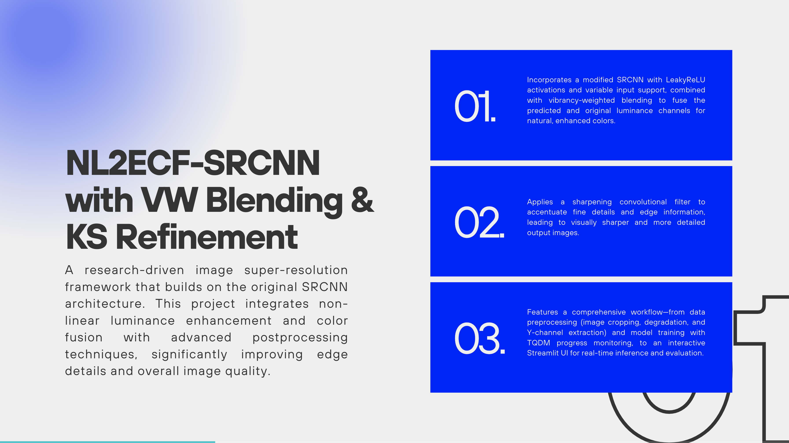
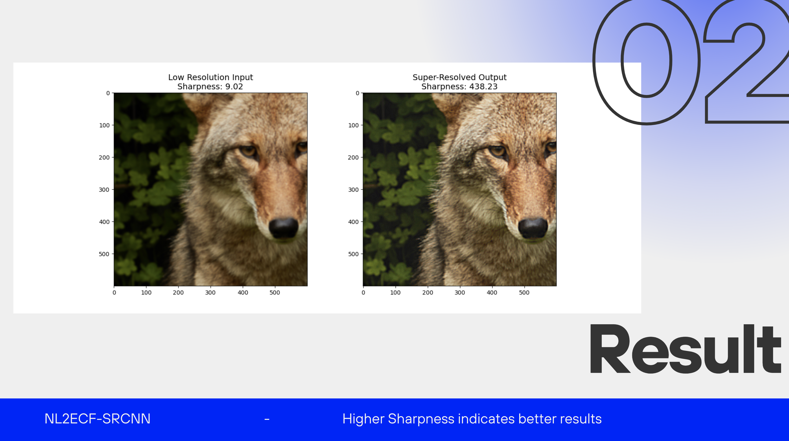
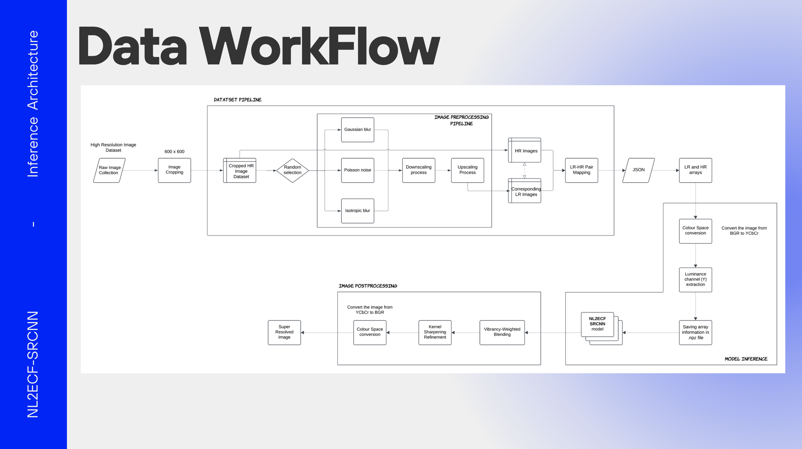
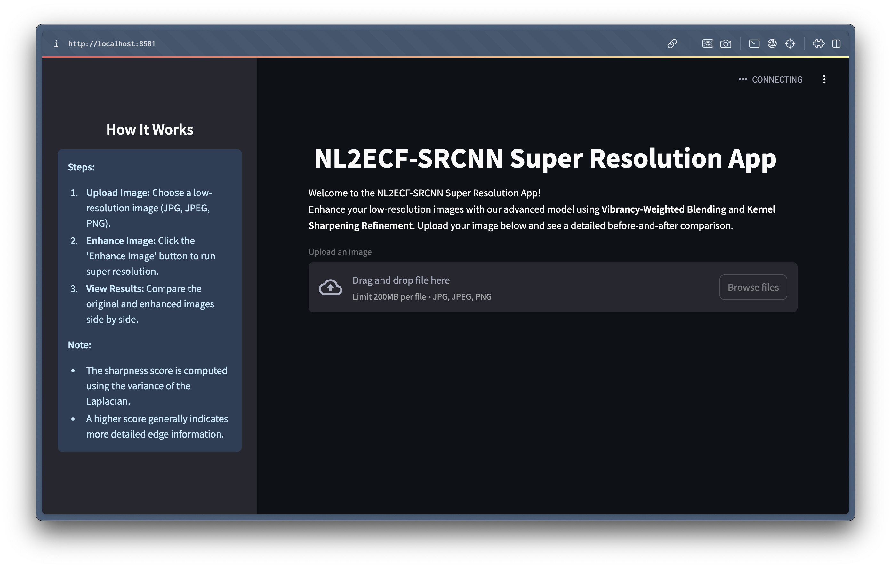

<!-- ============================ HEADER ============================ -->
<h1 align="center">Non-Linear Luminance Enhancement and Colour Fusion SRCNN with Vibrancy-Weighted Blending and Kernel Sharpening Refinement</h1>

<p align="center">
  <em>A deep learning tool that sharpens and upscales blurry, low-resolution images using a custom-trained convolutional neural network with intelligent post-processing.</em>
</p>

<!-- Badges. Generate at https://shields.io/. -->
<p align="center">
  <a href="https://github.com/Keegz-dz/NL2ECF-SRCNN-with-VW-Blending-and-KS-Refinement/commits/main">
    
  </a>
  <a href="./LICENSE">
    
  </a>
  <a href="https://www.tensorflow.org/">
    
  </a>
  <a href="https://www.python.org/downloads/release/python-3100/">
    
  </a>
  <a href="#">
    
  </a>
</p>

<!-- Animated demo GIF which conveys the project's value instantly. -->
<p align="center">
  
</p>

<!-- ============================ TL;DR ============================ -->
## Overview
Low-resolution images lose structural detail that standard interpolation methods cannot recover. NL2ECF-SRCNN addresses this by training a modified SRCNN on luminance channels and applying a two-stage postprocessing pass to restore edge sharpness and colour vibrancy. Built on an extended SRCNN architecture with LeakyReLU non-linearities and a flexible variable-input design, the model operates in YCbCr colour space, recovering the high-frequency luminance signal before fusing it with the original chrominance data. The result is a faithful reconstruction pipeline that consistently outperforms vanilla SRCNN under direct side-by-side comparison across multiple degradation types.

<p align="left">
  <a href="https://www.notion.so/Classical-Pixel-Interpolation-in-Image-Super-Resolution-Methods-and-Limitations-dc7dd85ebde04bbe95fb81326305a418?source=copy_link">
    
  </a>
</p>



<!-- ============================ TOC ============================ -->
## Table of Contents

1. [Key Results](#key-results)
2. [Demo](#demo)
3. [Architecture](#architecture)
4. [Installation](#installation)
5. [Project Structure](#project-structure)
6. [Training and Evaluation](#training-and-evaluation)
7. [Limitations](#limitations)
8. [Citation](#citation)
9. [Acknowledgements](#acknowledgements)
10. [Licence](#licence)
11. [Contact](#contact)

<!-- ============================ RESULTS ============================ -->
## Key Results

The proposed **NL2ECF-SRCNN** framework was evaluated against the original
SRCNN architecture introduced by Dong et al. in
*Image Super-Resolution Using Deep Convolutional Networks* (CVPR 2014),
with both models trained under identical experimental conditions on the same dataset.

<div align="center">

| Model | PSNR (dB) | SSIM | Sharpness |
|:--|:--:|:--:|:--:|
| SRCNN (Dong et al., 2014) | 5.05 | 0.32 | 9.02 |
| **NL2ECF-SRCNN + VW-Blending + KS-Refinement (Ours)** | **18.44** | **0.65** | **438.23** |
| **Relative Improvement** | **+13.39** | **+0.33** | **+429.21** |

</div>

<p align="center">
  <sub>The baseline was trained from scratch on the same dataset under controlled experimental conditions, as such, the reported metrics are not directly comparable to published Set5 or Set14 benchmark results. Higher values indicate better reconstruction quality.</sub>
</p>

The enhanced architecture demonstrates substantially improved reconstruction fidelity,
stronger edge preservation, and sharper texture recovery compared to the vanilla SRCNN baseline.

<br>

<p align="center">
  
</p>

<p align="center">
  <sub>
    Comparison between the low-resolution input and the reconstructed
    super-resolved output generated by the proposed framework.
  </sub>
</p>

<!-- ============================ DEMO ============================ -->
## Demo

https://github.com/user-attachments/assets/cf8a09b1-bbd7-4a97-8912-9c128a04b5a6

<!-- ============================ ARCHITECTURE ============================ -->
## Architecture

The system is a three-stage pipeline: colour-space preprocessing, CNN-based luminance prediction, and a classical post-processing pass. The CNN only ever sees the luminance (Y) channel — colour information is carried through the pipeline untouched and fused back at the end.

<p align="center">
  
</p>


### 1. Preprocessing

Every input image is converted from BGR to YCbCr, separating luminance from chrominance. The Y channel is extracted, resized to 128 × 128 via bicubic interpolation, and normalised to [0, 1]. The Cb and Cr channels are preserved in full for the post-processing step.

### 2. Model

A three-layer fully-convolutional network operating on a single-channel input of variable spatial size:

<div align="center">

| Stage | Filters | Kernel Size | Padding | Activation |
|:--|:--:|:--:|:--:|:--:|
| Feature Extraction | 128 | 9 × 9 | `same` | LeakyReLU (α = 0.3) |
| Non-Linear Mapping | 64 | 7 × 7 | `same` | LeakyReLU (α = 0.3) |
| Reconstruction | 1 | 5 × 5 | `same` | Linear |

</div>

<p align="center">
  <sub>Training configuration: Adam optimiser (lr = 0.0003) with Mean Squared Error (MSE) loss.</sub>
</p>

**Key differences from the original SRCNN (Dong et al., 2014):**
- `same` padding throughout — the spatial dimensions are preserved, so the output matches the input resolution without post-cropping.
- LeakyReLU (α = 0.3) replaces ReLU, allowing a small gradient for negative activations and reducing dead-neuron risk during training.
- The middle kernel is 7 × 7 instead of 3 × 3, giving the mapping layer a wider receptive field.
- The final layer has no bias term.
- Variable input shape `(None, None, 1)` — the model accepts arbitrary image sizes at inference time.

### 3. Post-processing

The raw CNN output is a predicted Y channel at 128 × 128. Two classical operations are then applied:

**Vibrancy-Weighted Blending (VW-Blending)**
The predicted Y is upsampled to the original image dimensions via Lanczos4 interpolation, then blended with the original Y channel:

$$
Y_{\text{final}} = (1 - \alpha)\,Y_{\text{original}} + \alpha\,Y_{\text{predicted}}
\qquad \alpha = 0.2
$$

This conservative blend preserves the input's natural tone while applying the CNN's structural corrections, avoiding the over-smoothing artefacts common in purely predicted outputs.

**Kernel Sharpening Refinement (KS-Refinement)**
A 3 × 3 unsharp-mask kernel is applied to the reconstructed BGR image as a final pass:

$$
\begin{bmatrix}
-1 & -1 & -1 \\
-1 &  9 & -1 \\
-1 & -1 & -1
\end{bmatrix}
$$

This amplifies edge contrast by subtracting a blurred neighbourhood from the centre pixel, recovering high-frequency detail that the blending step may have softened.

<!-- ============================ INSTALLATION ============================ -->
## Installation
 
 ### Prerequisites

- Python 3.10
- 8 GB RAM (16 GB recommended for training)
- An NVIDIA GPU with CUDA is optional but recommended for training; CPU is sufficient for inference

### Quick start

Run the application locally with a Python virtual environment:

1. Create and activate a virtual environment:
    ```bash
    python -m venv .venv
    source .venv/bin/activate
    ```
2. Install the required dependencies:
    ```bash
    pip install --upgrade pip
    pip install -r requirements.txt
    ```
3. Launch the Streamlit application:
    ```bash
    streamlit run streamlit_app.py
    ```
4. Open your browser and navigate to [http://localhost:8501](http://localhost:8501).

   

<!-- ============================ STRUCTURE ============================ -->
## Project Structure

```
NL2ECF-SRCNN-with-VW-Blending-and-KS-Refinement/
│
├── model/                          # Core model code
│   ├── model_architecture.py       # NL2ECF-SRCNN and original SRCNN layer definitions
│   ├── model_training.py           # Training loop, callbacks, and loss curves
│   ├── model_prediction.py         # Inference pipeline: preprocessing, prediction, post-processing
│   └── quality_metrics.py          # PSNR, SSIM, and MSE implementations
│
├── scripts/                        # Data preparation pipeline
│   ├── master_pipeline.py          # Single entry point that runs the full pipeline in order
│   ├── image_cropping.py           # Crops raw images into fixed-size HR patches
│   ├── dataset_creation.py         # Generates HR-LR pairs and writes hr_lr_pairs.json
│   ├── dataset_preparation.py      # Normalises and packs patch pairs into processed_data.npz
│   └── degradation_pipeline.py     # Applies blur, downscaling, and noise to produce LR images
│
├── evaluation/                     
│   ├── evaluation.py               # Side-by-side PSNR/SSIM comparison against original SRCNN
│   └── perceptual_eval.py          # Sharpness, artifact reduction, and per-image timing report
│
├── data/                           # Dataset directories (not tracked in git)
│   ├── raw_image_dataset/          # Source high-resolution images supplied by the user
│   ├── cropped_image_dataset/      # Fixed-size HR patches produced by image_cropping.py
│   ├── high_resolution_images/     # HR reference images used during evaluation
│   ├── low_resolution_images/      # Degraded LR counterparts produced by degradation_pipeline.py
│   └── hr_lr_pairs.json            # Manifest mapping each HR image to its LR variants
│
├── logs/                           # Training artefacts (not tracked in git)
│   ├── nl2ecf_srcnn_model.h5       
│   ├── original_srcnn_model.h5     # Trained original SRCNN weights (baseline)
│   └── processed_data.npz          # Packed and normalised patch pairs ready for training
│
├── assets/                         # Images used in README
│
├── streamlit_app.py                # Browser-based inference UI
├── requirements.txt                              
└── environment.yml                
```

<!-- ============================ TRAINING ============================ -->
## Training and Evaluation

### Data preparation

Place your high-resolution images in `data/raw_image_dataset/`, then run the pipeline from the `scripts/` directory. It crops the raw images into fixed-size patches, synthesises low-resolution counterparts via blur and downscaling, and packs everything into a single compressed archive.

```bash
cd scripts && python master_pipeline.py
```

Expected output:
```
Starting Image Cropping...
Starting Dataset Creation...
Starting Dataset Preparation...
Overall Pipeline Progress: 100%|████████| 900/900 [02:14<00:00]
```

Produces `logs/processed_data.npz` and `data/hr_lr_pairs.json`.

### Training

Run from the project root. Training defaults to 10 epochs with a batch size of 16 and a 20 % validation split. Model training complete and saved as `logs/nl2ecf_srcnn_model_v1.h5`.

```bash
python -c "from model.model_training import main; main(model_type='nl2ecf')"
```

Expected output:
```
Training NL2ECF-SRCNN model...
Data path: logs/processed_data.npz
Model save path: logs/nl2ecf_srcnn_model_v1.h5
Epoch 1/10
```


A training and validation loss curve is displayed on completion. To also train the original SRCNN baseline for comparison:

```bash
python -c "from model.model_training import main; main(model_type='original')"
```

### Evaluation

Run the comparative evaluation from the project root. It loads both trained models, scores them across the dataset, prints a results table, and saves a bar chart to `model_comparison.png`.

```bash
python -m evaluation.evaluation
```

Expected output:
```
============================================================
EVALUATION RESULTS (N samples)
============================================================
Metric     Custom Model    Original Model  Improvement
--------------------------------------------------------------
PSNR       18.44           5.05            13.39
SSIM       0.65            0.32            0.33

✓ Custom model shows 13.39 dB better PSNR than original SRCNN
✓ Custom model shows 0.3300 better SSIM than original SRCNN
```

For a more detailed report covering sharpness gain, artifact reduction, and per-image timing:

```bash
python -m evaluation.perceptual_eval
```

<!-- ============================ LIMITATIONS ============================ -->
## Limitations

1. **The CNN always operates on a 128 × 128 crop, not the full image.**
In `model_prediction.py`, every input image is resized to 128 × 128 before being passed to the network, regardless of its original dimensions. The predicted Y channel is then upsampled back to the original size via Lanczos4. For small inputs this is fine, but for large images the network never sees fine-grained detail it reasons about a downsampled thumbnail and the upsampling step fills in the rest. A tiled or patch-based inference strategy would be needed to preserve full-resolution detail at scale.

2. **The CNN contributes only 20 % to the final output.**
The Vibrancy-Weighted Blending step mixes the predicted Y channel with the original at a fixed ratio of 0.2 / 0.8 (`vibrancy_weight = 0.2` in `nl2ecf_postprocess`). This conservative blend means the model's learned corrections are heavily diluted, and much of the perceived sharpness improvement in the results comes from the fixed 3 × 3 unsharp-mask kernel applied afterward rather than from anything the network learned. The α value is not tuned per image or per content type.

3. **Only the luminance channel is enhanced.**
The model processes the Y channel in YCbCr space and leaves the Cb and Cr chrominance channels completely untouched. For images where colour detail degrades alongside luma, heavy JPEG compression, for instance the output will show sharper edges on an otherwise colour-degraded background. Full-colour super-resolution would require either an RGB pipeline or explicit chrominance enhancement.

<!-- ============================ CITATION ============================ -->
## Citation

If you use this work in your research, please cite:

```bibtex
@software{dsouza2024nl2ecf,
  author       = {Dsouza, Keegan and Chaudhary, Atharv Girish},
  title        = {NL2ECF-SRCNN: Non-Linear Luminance Enhancement and Colour Fusion SRCNN with Vibrancy-Weighted Blending and Kernel Sharpening Refinement},
  year         = {2024},
  url          = {https://github.com/Keegz-dz/NL2ECF-SRCNN-with-VW-Blending-and-KS-Refinement},
  version      = {1.0.0}
}
```

<!-- ============================ ACKNOWLEDGEMENTS ============================ -->
## Acknowledgements

This project builds on the following prior work:
- **Dong, C., Loy, C. C., He, K., & Tang, X. (2014).** Learning a Deep Convolutional Network for Image Super-Resolution. *European Conference on Computer Vision (ECCV)*. The original SRCNN architecture that this project extends. [Paper](https://arxiv.org/abs/1501.00092)

<!-- ============================ LICENCE ============================ -->
## Licence
 
This project is released under the MIT Licence. See [`LICENSE`](LICENSE) for full text.

<!-- ============================ CONTACT ============================ -->
## Contact

Maintained by [Keegan Dsouza](https://github.com/Keegz-dz). For bug reports and feature requests, please open an issue on the [issue tracker](https://github.com/Keegz-dz/NL2ECF-SRCNN-with-VW-Blending-and-KS-Refinement/issues).

<p align="left">
  <a href="https://www.linkedin.com/in/keegan-dz/">
    
  </a>
  <a href="mailto:keegz29.dz@gmail.com">
    
  </a>
  &nbsp;&nbsp;
  <a href="https://www.linkedin.com/in/atharv-girish-chaudhary-529848378/">
    
  </a>
  <a href="mailto:chaudharyatharvgirish@gmail.com">
    
  </a>
</p>
