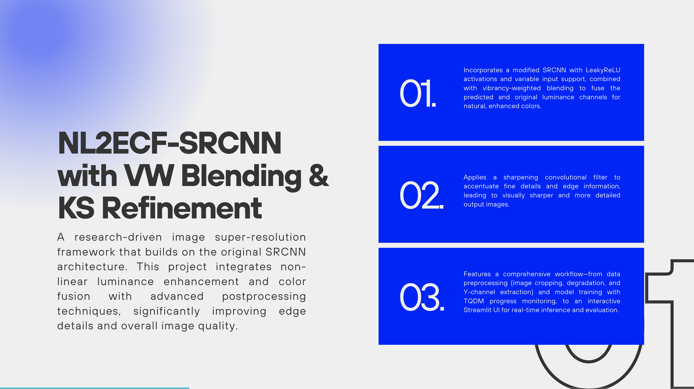
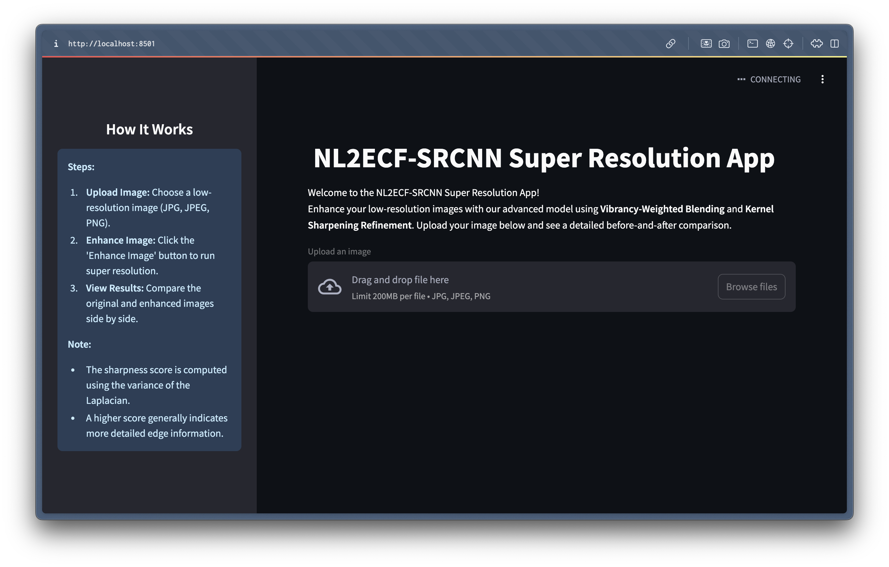
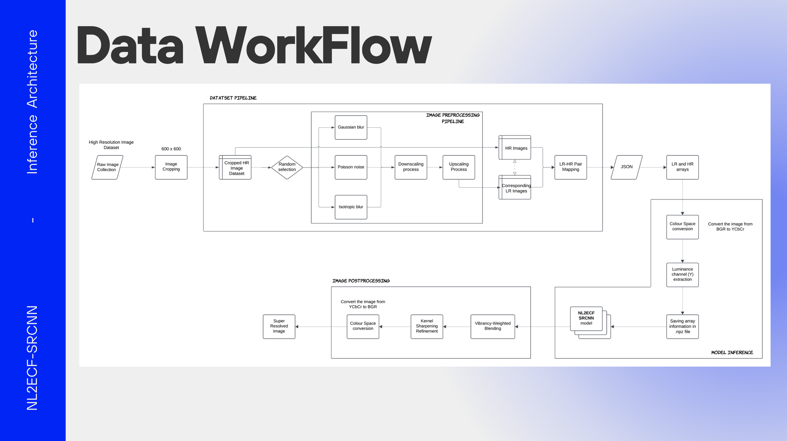

# Non-Linear Luminance Enhancement and Colour Fusion SRCNN with Vibrancy-Weighted Blending and Kernel Sharpening Refinement

The **NL2ECF-SRCNN** project is a research-based application for image super-resolution. It leverages a modified SRCNN architecture with Non-Linear Luminance Enhancement and Color Fusion, employing Vibrancy-Weighted Blending and Kernel Sharpening Refinement to produce high-quality super-resolved images. The project includes components for data preprocessing, model training, evaluation, and an interactive Streamlit UI for inference.



This repository includes all the necessary scripts and a Docker-based setup for easy installation and deployment.


## File Requirements

For training and evaluation, the following data files are expected:
- **Raw HR Images:** Stored in `data/raw_image_dataset`
- **Cropped HR Images:** Generated and stored in `data/cropped_image_dataset`
- **Degraded LR Images:** Generated and stored in `data/low_resolution_images`
- **HR-LR Mapping:** JSON file (`data/hr_lr_pairs.json`)
- **Processed Data:** Saved as `logs/processed_data.npz`

For inference using the Streamlit UI, a low-resolution image (JPG, JPEG, or PNG) is required.

## Features

- **Data Preprocessing Pipeline:**
  - Image cropping and degradation to create HR-LR image pairs.
  - Preprocessing of images (conversion to YCbCr and resizing of the Y channel).
  
- **Model Training & Evaluation:**
  - Train the modified NL2ECF-SRCNN model using preprocessed data.
  - Visualize training and validation loss curves.
  
- **Interactive Super-Resolution Inference:**
  - Streamlit-based UI for uploading a low-resolution image and viewing the enhanced output.
  - Displays side-by-side comparison with computed sharpness scores.
  
- **Advanced Postprocessing:**
  - Vibrancy-Weighted Blending to fuse predicted and original luminance.
  - Kernel Sharpening Refinement for enhancing edge details.


## Installation and Setup

1. Clone the repository and Navigate to root directory.
2. Run the following command to build the Docker image and start the application:
    ```bash
    docker compose up --build
    ```
3. Open your browser and navigate to
    ```bash
    http://localhost:8501
    ```
    

## How to Run

### Training and Evaluation

1. **Data Preparation & Preprocessing:**

    - Place your high-resolution images in the data/raw_image_dataset folder.

    - Run the preprocessing scripts to crop images, generate degraded LR images, and prepare the dataset.
    <br>(Scripts: `image_cropping.py`, `dataset_creation.py`, `dataset_preparation.py`)

2. **Model Training:**

    - Execute the training script to train the NL2ECF-SRCNN model:
        ``` bash
        python model_training.py
        ```

    - The trained model weights will be saved as `logs/nl2ecf_srcnn_model.h5`.

    - Training and validation loss curves are plotted upon completion.
        


3. **Model Evaluation:**

    - Evaluate your model using quality metrics (e.g., PSNR, MSE, SSIM) with the provided evaluation scripts (see model/quality_metrics.py).

### Inference Using the Streamlit App

1. **Run the Inference UI:**

    - Ensure the trained model `logs/nl2ecf_srcnn_model.h5` is available.
    - Open your browser and navigate to
        ```bash
        http://localhost:8501
        ```

## Technology Stack


## Troubleshooting
- **Missing Data Files:**
Ensure that the raw images are placed in data/raw_image_dataset before running the preprocessing scripts.

- **Training Errors:**
Check that all dependencies (TensorFlow, Keras, OpenCV, etc.) are installed correctly.
Verify that the processed dataset (logs/processed_data.npz) exists.

- **UI Issues:**
If the Streamlit app does not display correctly, ensure your browser supports modern CSS, and try clearing your browser cache.

- **Performance Issues:**
For large datasets or high-resolution images, consider reducing image dimensions or using a more powerful machine for training.

## Legal Attribution
The original SRCNN architecture (referenced in original_SRCNN_Model) is based on:

    Dong, C., Loy, C.C., He, K., & Tang, X. (2014). Image Super-Resolution Using Deep Convolutional Networks. IEEE Conference on Computer Vision and Pattern Recognition (CVPR).

This research project builds upon that work with significant modifications for non-linear luminance enhancement, color fusion and post-processing improvements.